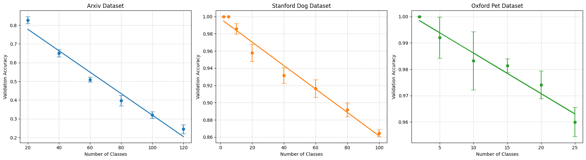
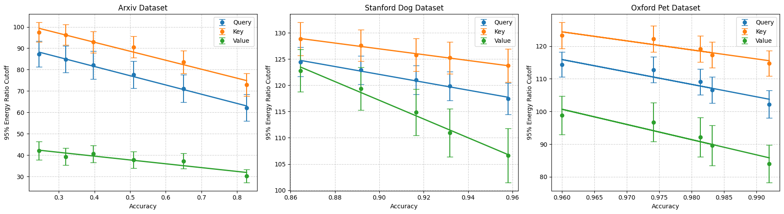
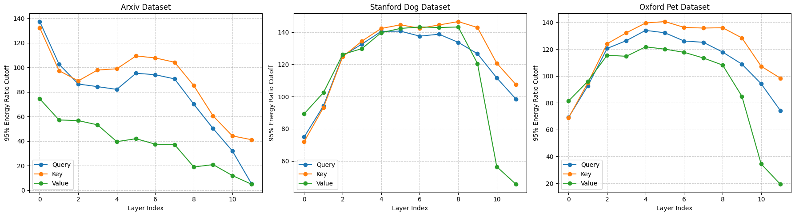
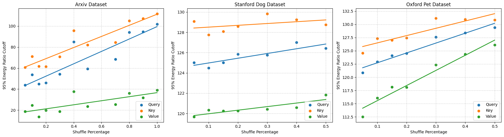

# Exploring the Correlation between LoRA and Task Complexity

## Overview
This repository contains the code and resources used for our research on understanding the relationship between Low-Rank Adaptation (LoRA) and task complexity. Our work examines how the intrinsic rank of LoRA matrices relates to the difficulty of a task across both vision and text-based datasets.

## Abstract
LoRA is an efficient method for fine-tuning large models by introducing low-rank update matrices. This study explores the connection between the intrinsic rank of the weight update matrix $$\Delta W = AB$$ and the complexity of the given task. By conducting experiments on vision (Stanford Dogs, Oxford Pets) and text (ArXiv corpus) datasets, we find a strong positive correlation between task complexity and the intrinsic rank of LoRA updates. Additionally, we analyze layerwise trends in intrinsic rank and their implications for model interpretability. Our findings provide insight into optimizing LoRA hyperparameters and improving efficiency in model adaptation.

## Key Findings
- **Task Complexity Proxy**:
  - The number of classes in classification tasks correlates negatively with full fine-tuning accuracy. Thus, we can use the number of classes in classification tasks as a proxy for task complexity.



- **Intrinsic Rank Correlation**: The intrinsic rank of LoRA’s adaptation matrices increases as task complexity increases.

- **Layerwise Trends**:
  - In BERT (text model), the intrinsic rank decreases across layers.
  - In ViTs (vision models), intrinsic rank follows a bell curve, increasing in early layers and decreasing in later layers.

- **Noise and Memorization**:
  - Introducing label noise increases intrinsic rank, suggesting that LoRA adapts to complexity by allocating more parameters when tasks require memorization.
  
## Repository Contents
- `code/` - Contains all scripts and notebooks used for data processing, model training, and analysis.
- `data/` - Links to datasets used in experiments.
- `results/` - Visualizations and extracted findings.
- `LoRA_Final_Report.pdf` - [Research Paper](./LoRA_Final_Report.pdf)

## Installation and Usage
1. Clone this repository:
   ```bash
   git clone https://github.com/Raphael138/LoRA-Score.git
   cd LoRA-Score
   ```
2. Install dependencies:
   ```bash
   pip install -r requirements.txt
   ```
<!-- 3. Run experiments:
   ```bash
   python train.py --dataset arxiv --lora_rank 8
   ``` -->


<!-- ## Visualizations
Key result images can be found in the `results/` directory. Example plots include:
- Task complexity vs. intrinsic rank
- Layerwise intrinsic rank trends
- Noise impact on intrinsic rank -->

